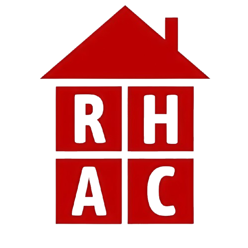
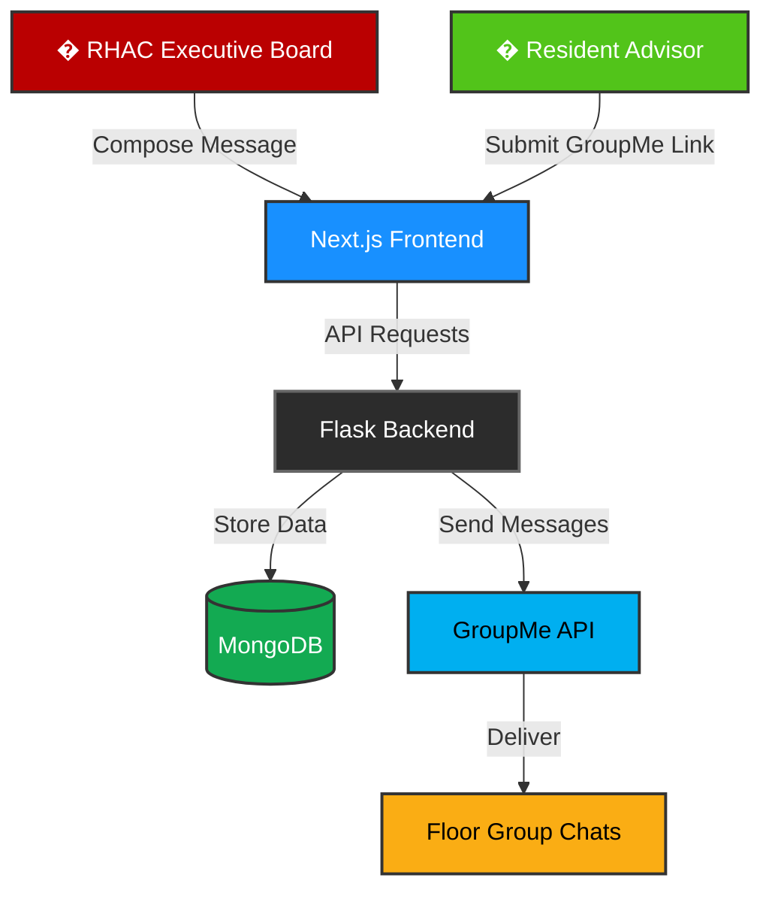

<div align="center">
  
  
  # 🏢 RHACbot Control Panel
  
  <p align="center">
    <strong>Streamline campus-wide communication across residence halls</strong>
  </p>
  
  <p align="center">
    A powerful platform to connect and broadcast messages to GroupMe floor chats across multiple buildings and regions
  </p>
  
  <p align="center">
    <a href="#-features">Features</a> •
    <a href="#-quick-start">Quick Start</a> •
    <a href="#-architecture">Architecture</a> •
    <a href="#-deployment">Deployment</a>
  </p>
  
  <p align="center">
    
    
    
    
    
  </p>
</div>

---

## 🎯 What is RHACbot?

**RHACbot** is a comprehensive communication management system designed for Residence Hall Advisory Councils (RHAC) to efficiently broadcast announcements, event updates, and important information to students across campus residence halls.

### The Problem It Solves

Managing communication across dozens of residence hall floor chats is challenging:
- 📱 **Scattered Groups**: Floor chats spread across multiple buildings and regions
- ⏰ **Time-Consuming**: Manually posting to each chat takes significant time
- 🎯 **Targeting Issues**: Difficulty sending region-specific or building-specific messages
- 📊 **No Central Control**: No unified system to manage which chats are connected

### The RHACbot Solution

<table>
<tr>
<td width="50%">

**🚀 For Administrators**
- Send messages to entire campus or specific regions with one click
- Target individual buildings or custom combinations
- Manage connected floor chats centrally
- Secure password-protected access

</td>
<td width="50%">

**🏘️ For Residents**
- Simple GroupMe link submission
- Receive relevant announcements automatically
- Stay informed about campus events
- Connect their floor in under a minute

</td>
</tr>
</table>

---

## ✨ Features

<table>
<tr>
<td>

### 📢 **Smart Message Broadcasting**
- **Hierarchical Targeting**: Choose Campuswide, specific regions (North Campus, South Campus, etc.), or individual buildings
- **Mixed Selections**: Combine regions and specific buildings for precise targeting
- **One-Click Distribution**: Send to hundreds of students instantly
- **GroupMe Integration**: Native API integration for reliable delivery

</td>
<td>

### 🏗️ **Intelligent Organization**
- **Regional Grouping**: Buildings organized by campus region
- **Searchable Interface**: Quick building lookup
- **Collapsed Tree View**: Clean, navigable interface
- **Parent-Child Logic**: Select a region to automatically include all buildings

</td>
</tr>
<tr>
<td>

### 🔐 **Security & Reliability**
- **Password Protection**: Secure admin-only access
- **Environment-Based Config**: Separate dev/prod configurations
- **CORS Protection**: Backend security for API requests
- **MongoDB Storage**: Persistent, scalable database with in-memory fallback

</td>
<td>

### 🧪 **Production-Ready**
- **77 Backend Tests**: Comprehensive test coverage
- **26 Frontend Tests**: UI logic validation
- **Pre-Deploy Checks**: Railway tests before deployment
- **TypeScript**: Type-safe frontend development

</td>
</tr>
</table>

---

## 🏗️ Architecture



### 📦 Monorepo Structure

```
RHACbot/
├── 🎨 rhacbot-next/          # Next.js 16 Frontend (TypeScript + React 19)
│   ├── src/app/              # App router pages
│   │   ├── send-message/     # Message broadcasting interface
│   │   ├── add-chat/         # Floor chat registration
│   │   └── learn-more/       # Information page
│   ├── lib/                  # API client & utilities
│   ├── __tests__/            # Jest test suite (26 tests)
│   └── data/                 # Buildings & regions data
│
├── ⚙️ backend/                # Flask 3.x API (Python 3.12)
│   ├── app.py                # Main Flask application
│   ├── models.py             # MongoDB models
│   ├── config.py             # Environment configuration
│   ├── test_suite.py         # Backend tests (77 tests)
│   ├── gunicorn_config.py    # Production WSGI config
│   └── railway.toml          # Railway deployment config
│
└── 📊 data/
    └── buildings.json        # Campus buildings database
```

---

## 🚀 Quick Start

### Prerequisites

- **Node.js** 18+ (for frontend)
- **Python** 3.12+ (for backend)
- **GroupMe Account** with API access token
- **MongoDB** (optional for development - uses in-memory fallback)

### 1️⃣ Clone the Repository

```bash
git clone https://github.com/WesleyKamau/RHACbot.git
cd RHACbot
```

### 2️⃣ Backend Setup

```powershell
# Navigate to backend
cd backend

# Create virtual environment
python -m venv .venv
.\.venv\Scripts\Activate.ps1

# Install dependencies
pip install -r requirements.txt

# Configure environment
cp .env.example .env
# Edit .env with your credentials:
#   - GROUPME_ACCESS_TOKEN
#   - ADMIN_PASSWORD
#   - MONGODB_URI (optional)

# Run tests
python test_suite.py

# Start development server
python app.py
```

Backend runs on `http://localhost:5000`

### 3️⃣ Frontend Setup

```powershell
# Navigate to frontend (from root)
cd rhacbot-next

# Install dependencies
npm install

# Configure environment
# Create .env.local with:
#   NEXT_PUBLIC_API_URL=http://localhost:5000

# Run tests
npm test

# Start development server
npm run dev
```

Frontend runs on `http://localhost:3000`

### 4️⃣ Access the Application

1. **Open** `http://localhost:3000`
2. **Navigate** to "Send Message" and authenticate with your admin password
3. **Select** target buildings/regions
4. **Send** your first announcement! 🎉

---

## 🧪 Testing

### Backend Tests (77 total)
```bash
cd backend
python test_suite.py
```

**Coverage includes:**
- ✅ Authentication endpoints
- ✅ Message sending logic
- ✅ Region filtering (case-insensitive)
- ✅ Building validation
- ✅ Database operations
- ✅ CORS configuration
- ✅ Error handling

### Frontend Tests (26 total)
```bash
cd rhacbot-next
npm test
```

**Coverage includes:**
- ✅ Tree select hierarchy (Campuswide → Regions → Buildings)
- ✅ Parent-child checkbox behavior
- ✅ Backend request format validation
- ✅ Region and building selection logic
- ✅ Edge cases and real-world scenarios

---

## 🚢 Deployment

### Backend → Railway

The backend is configured for seamless Railway deployment:

```toml
# railway.toml
[build]
builder = "NIXPACKS"
buildCommand = "pip install -r requirements.txt && python test_suite.py"

[deploy]
startCommand = "gunicorn -c gunicorn_config.py app:app"
healthcheckPath = "/api/health"
```

**Environment Variables Required:**
- `GROUPME_ACCESS_TOKEN`
- `ADMIN_PASSWORD`
- `MONGODB_URI`
- `FLASK_ENV=production`

**Deploy:**
```bash
# Link Railway project
railway link

# Deploy with pre-deploy tests
git push railway main
```

### Frontend → Vercel

The Next.js frontend deploys automatically to Vercel:

**Environment Variables Required:**
- `NEXT_PUBLIC_API_URL` (your Railway backend URL)

**Deploy:**
```bash
# Install Vercel CLI
npm i -g vercel

# Deploy
cd rhacbot-next
vercel --prod
```

---

## 🔧 Configuration

### Backend Environment Variables

| Variable | Description | Required | Default |
|----------|-------------|----------|---------|
| `GROUPME_ACCESS_TOKEN` | GroupMe API token | ✅ Yes | - |
| `ADMIN_PASSWORD` | Admin authentication password | ✅ Yes | - |
| `MONGODB_URI` | MongoDB connection string | ❌ No | In-memory |
| `FLASK_ENV` | Environment (`dev`/`prod`) | ❌ No | `dev` |
| `SECRET_KEY` | Flask session secret | ❌ No | Auto-generated |
| `CORS_ORIGINS` | Allowed CORS origins (regex) | ❌ No | localhost |

### Frontend Environment Variables

| Variable | Description | Required |
|----------|-------------|----------|
| `NEXT_PUBLIC_API_URL` | Backend API URL | ✅ Yes |

---

## 📚 API Documentation

### Authentication
```http
POST /api/auth
Content-Type: application/json

{
  "password": "your_admin_password"
}
```

### Send Message
```http
POST /api/send-message
Content-Type: application/json

{
  "message_body": "Your announcement here",
  "regions": ["all"],  // or ["North", "South"] or empty
  "building_ids": []   // or [1, 5, 10] for specific buildings
}
```

### Add Floor Chat
```http
POST /api/add-chat
Content-Type: application/json

{
  "groupme_link": "https://groupme.com/join_group/...",
  "building_id": 1,
  "floor_number": 3
}
```

Full API documentation: [API.md](API.md)

---

## 🛠️ Tech Stack

### Frontend
- **Framework**: Next.js 16.0 (App Router)
- **UI Library**: React 19
- **Language**: TypeScript 5.x
- **Components**: Ant Design 5.x
- **State Management**: React Hooks
- **Testing**: Jest + React Testing Library
- **Styling**: CSS Modules + Ant Design Theme

### Backend
- **Framework**: Flask 3.x
- **Language**: Python 3.12
- **Database**: MongoDB (via PyMongo)
- **WSGI Server**: Gunicorn
- **Testing**: Python unittest (77 tests)
- **API Integration**: GroupMe API

### DevOps
- **Frontend Hosting**: Vercel
- **Backend Hosting**: Railway
- **CI/CD**: Pre-deploy test hooks
- **Version Control**: Git + GitHub

---

## 🤝 Contributing

Contributions are welcome! Please follow these steps:

1. **Fork** the repository
2. **Create** a feature branch (`git checkout -b feature/amazing-feature`)
3. **Run tests** to ensure everything works:
   ```bash
   # Backend
   cd backend && python test_suite.py
   
   # Frontend
   cd rhacbot-next && npm test
   ```
4. **Commit** your changes (`git commit -m 'Add amazing feature'`)
5. **Push** to the branch (`git push origin feature/amazing-feature`)
6. **Open** a Pull Request

---

## 📝 License

This project is part of the OSU Residence Hall Advisory Council (RHAC) infrastructure.

---

## 👥 Support

- **Issues**: [GitHub Issues](https://github.com/WesleyKamau/RHACbot/issues)
- **Questions**: Open a discussion or issue
- **RHAC**: Contact your local Residence Hall Advisory Council

---

<div align="center">
  <p>Made with ❤️ for Ohio State residence halls</p>
  <p>
    <strong>Empowering student communication across campus</strong>
  </p>
</div>
